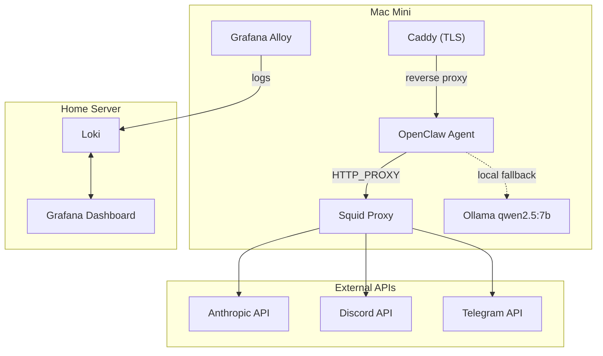
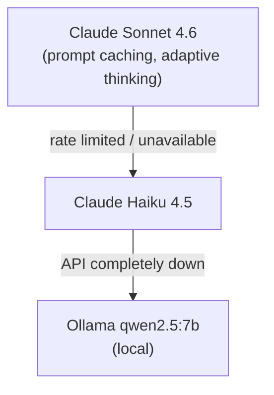
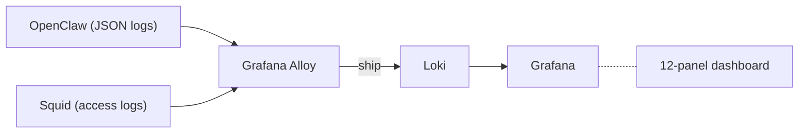
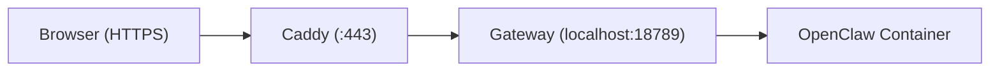

# Hardening an Autonomous AI Agent: How I Deployed OpenClaw on a Mac Mini

I've been running a self-hosted Discord bot called "Regular Charmer" — powered by [OpenClaw](https://github.com/openclaw/openclaw), an autonomous AI agent gateway. It talks to Claude, routes between models, and can take actions on its own. That last part is what makes it interesting to build — and terrifying to deploy.

An autonomous agent isn't like a web app. It makes decisions, calls APIs, and can surprise you. The security posture has to match: you're not just protecting the agent from the outside world, you're also protecting the outside world from the agent.

This post walks through the architecture, the hardening layers, and the cost controls I put in place to run this thing at home without losing sleep (or money).

## The Architecture

The deployment splits across two machines on my local network:



**Mac Mini** runs the agent, an egress proxy, a local LLM, and a TLS reverse proxy. **Home Server** runs centralized logging and dashboards. The separation keeps observability independent from the thing being observed — if the agent misbehaves, I can still see what happened.

## Why Apple Containers?

macOS 26 introduced Apple Containers — a native container runtime with a `container` CLI that feels a lot like Docker. Since the Mac Mini runs macOS, this was a natural fit. No Docker Desktop license, no Linux VM overhead.

The trade-offs:

- **No `docker compose`** — you script the orchestration yourself
- **No `restart` command** — stop, remove, and re-run
- **Port-forwarding bugs** — HTTP responses don't relay for non-localhost connections (hence Caddy)
- **Different networking** — containers live on a `192.168.64.0/24` vmnet subnet instead of Docker's `172.x` bridges

The startup script handles all the sequencing — Ollama first, then Squid, then OpenClaw:

```bash
#!/bin/bash
set -euo pipefail

DEPLOY_DIR="$HOME/openclaw"

# Start Squid egress proxy
container run --detach --name squid \
    --cpus 1 --memory 256m \
    --network openclaw-net \
    --tmpfs /var/run/squid \
    --tmpfs /var/spool/squid \
    --tmpfs /var/log/squid \
    -v "$DEPLOY_DIR/squid":/etc/squid \
    ubuntu/squid:latest

# Start OpenClaw agent
container run --detach --name openclaw \
    --cpus 4 --memory 2g \
    --network openclaw-net \
    -p 127.0.0.1:18789:18789 \
    --env-file "$DEPLOY_DIR/.env" \
    --read-only \
    --tmpfs /tmp \
    --tmpfs /home/node/.cache \
    -v "$DEPLOY_DIR/openclaw-state":/home/node/.openclaw \
    -v "$DEPLOY_DIR/credentials":/app/credentials \
    --user 1000:1000 \
    ghcr.io/openclaw/openclaw:latest
```

The `--read-only` flag, non-root `--user`, and explicit resource limits (`--cpus`, `--memory`) are all load-bearing. More on that next.

## Security: Defense in Depth

The security model has four layers. Any one of them should be enough to prevent disaster; together, they make me comfortable running an autonomous agent on my home network.

### Layer 1: Container Isolation

The OpenClaw container runs with the principle of least privilege:

| Control | Setting | Why |
|---------|---------|-----|
| Read-only rootfs | `--read-only` | Agent can't modify its own binaries or config |
| Non-root user | `--user 1000:1000` | No privilege escalation inside the container |
| Capability drop | `cap_drop: ALL` | Remove all Linux capabilities |
| Minimal add-back | `cap_add: NET_BIND_SERVICE` | Only what's strictly needed |
| No new privileges | `no-new-privileges: true` | Prevents setuid/setgid escalation |
| tmpfs for scratch | `/tmp`, `/home/node/.cache` | Writable space is ephemeral and size-limited |
| Seccomp profile | Custom syscall filter | Block dangerous syscalls at the kernel level |

The Docker Compose reference file shows the full picture:

```yaml
services:
  openclaw:
    image: ghcr.io/openclaw/openclaw:latest
    read_only: true
    user: "1000:1000"
    security_opt:
      - no-new-privileges:true
      - seccomp=openclaw-seccomp.json
    cap_drop:
      - ALL
    cap_add:
      - NET_BIND_SERVICE
    deploy:
      resources:
        limits:
          memory: 2g
          cpus: "4"
        reservations:
          memory: 512m
          cpus: "1"
```

### Layer 2: Network — pf Firewall

The Mac Mini runs a pf (packet filter) firewall that blocks everything inbound by default, then punches narrow holes:

```
# Block all inbound by default
set block-policy drop
block in log all

# SSH from LAN only
pass in quick on $ext_if proto tcp \
    from 192.168.0.0/24 to any port 22

# HTTPS (Control UI) from LAN only
pass in quick on $ext_if proto tcp \
    from 192.168.0.0/24 to any port 443

# Ollama: container subnet only, not LAN
pass in quick on bridge100 proto tcp \
    from 192.168.65.0/24 to any port 11434
block in quick on bridge100 proto tcp \
    from any to any port 11434
```

The key rule here is the Ollama restriction. The local LLM server binds to `0.0.0.0` (Apple Containers requires it), but the firewall ensures only the container subnet can reach it — not other devices on the LAN.

### Layer 3: Egress — Squid Proxy

This is arguably the most important layer. The agent's outbound traffic is forced through a Squid proxy with an explicit domain allowlist:

```conf
# Domain Allowlist
acl allowed_domains dstdomain api.anthropic.com
acl allowed_domains dstdomain discord.com
acl allowed_domains dstdomain discord.gg
acl allowed_domains dstdomain discordapp.com
acl allowed_domains dstdomain discord.media
acl allowed_domains dstdomain telegram.org
acl allowed_domains dstdomain ghcr.io
acl allowed_domains dstdomain docker.io
acl allowed_domains dstdomain registry.npmjs.org

# Allow only from container network to allowlisted domains
http_access allow localnet allowed_domains

# Deny everything else
http_access deny all
```

The OpenClaw container gets `HTTP_PROXY` and `HTTPS_PROXY` environment variables pointing at Squid. It can talk to exactly six services: Anthropic's API, Discord, Telegram, and three container registries for updates. Nothing else leaves the network.

Squid also strips identifying headers and limits request/response sizes:

```conf
forwarded_for delete
via off
request_body_max_size 10 MB
reply_body_max_size 50 MB
```

### Layer 4: Credential Management

Credentials are separated from the container image and config:

- `.env` file with mode `600` — only the deploying user can read it
- Discord token and other secrets live in a dedicated `credentials/` directory, mounted read-only
- The gateway requires token authentication — no open endpoints
- The Control UI requires device pairing: each new browser must be explicitly approved via CLI

```bash
# List pending device pairing requests
container exec openclaw openclaw devices list

# Approve a specific device
container exec openclaw openclaw devices approve <request-id>
```

## Model Routing and Cost Control

Running Claude Sonnet for every message gets expensive fast. The agent uses a tiered model routing strategy:



A heartbeat call runs every 55 minutes on Haiku to keep the prompt cache warm. When the primary model is available, prompt caching alone cuts input token costs by up to 90%.

For deep reasoning tasks — architecture decisions, complex debugging — users can invoke `/agent deep` which routes to Claude Opus. This is intentionally opt-in because Opus costs significantly more.

### What the Numbers Look Like

At the time of deployment (March 2026), here's the pricing landscape for agent workloads:

| Provider | Model | Cost at 1M tokens/day |
|----------|-------|-----------------------|
| Anthropic | Sonnet 4.6 | ~$234/mo |
| Anthropic | Haiku 4.5 | ~$78/mo |
| Google | Gemini 2.5 Flash | ~$35/mo |
| DeepSeek | V3.2 | ~$10/mo |
| Local | Ollama (electricity) | ~$30/mo |

By routing 70% of traffic through Haiku and 30% through Sonnet, with prompt caching on both, the effective cost drops to roughly 40-50% of running Sonnet exclusively.

The local Ollama fallback exists purely as a safety net. When it kicks in, the bot sends a notice to users that it's running on reduced capability. The 7B parameter model handles basic conversation but can't do complex reasoning or tool use reliably.

## Observability

Logs flow from the Mac Mini to a centralized Loki instance on the home server via Grafana Alloy:



The OpenClaw container emits structured JSON logs with embedded metrics that Loki extracts:

| Metric | Type | What it Tracks |
|--------|------|----------------|
| `openclaw_tokens_in` | Counter | Input tokens consumed |
| `openclaw_tokens_out` | Counter | Output tokens generated |
| `openclaw_cost_usd` | Counter | Running cost in USD |
| `openclaw_request_duration_ms` | Histogram | Request latency distribution |

A 12-panel Grafana dashboard shows token usage over time, cost accumulation, request latency percentiles, error rates, and model selection breakdown. This is where I'd see if the agent got stuck in a loop or started burning through tokens on failed retries.

Debug-level logs are dropped in production to save bandwidth — only `info` and above ship to Loki.

## The Control UI

OpenClaw ships with a web-based Control UI for managing the agent. Getting it accessible on the LAN required a workaround:



Apple Containers has a bug where HTTP responses aren't relayed for non-localhost connections — TCP connects but nothing comes back. Caddy runs on the host, terminates TLS with a self-signed certificate, and proxies to the gateway on localhost, bypassing the issue.

The Control UI requires a secure context (HTTPS or localhost) for device identity, so Caddy pulling double duty as a TLS terminator is a nice fit.

## Lessons Learned

**Egress filtering is the single most impactful control.** If an autonomous agent can only talk to a handful of domains, the blast radius of any misbehavior shrinks dramatically. The Squid allowlist took 30 minutes to set up and provides more peace of mind than everything else combined.

**Apple Containers is promising but rough.** The lack of `docker compose` equivalence means more bash scripting. The port-forwarding bug cost me hours. But native performance on macOS without a Linux VM is compelling. It'll get better.

**Separate your observability from your workload.** If the agent container crashes or misbehaves, having logs on a different machine means you can always investigate. This is basic infrastructure practice but easy to skip for a "just a bot" deployment.

**Model routing pays for itself immediately.** Most Discord messages don't need Sonnet-level reasoning. Haiku handles them fine at a third of the cost. The prompt caching heartbeat adds pennies per day and saves dollars on every cached request.

**Treat your home agent like production infrastructure.** Read-only filesystems, non-root users, capability drops, resource limits — these aren't enterprise theater. They're the difference between "the bot had a bad day" and "the bot had a bad day and also modified its own config, exhausted my API credits, and spammed every Discord channel it could reach."

The full deployment repository — scripts, configs, firewall rules, Grafana dashboards — is available if you want to adapt it for your own agent setup.
